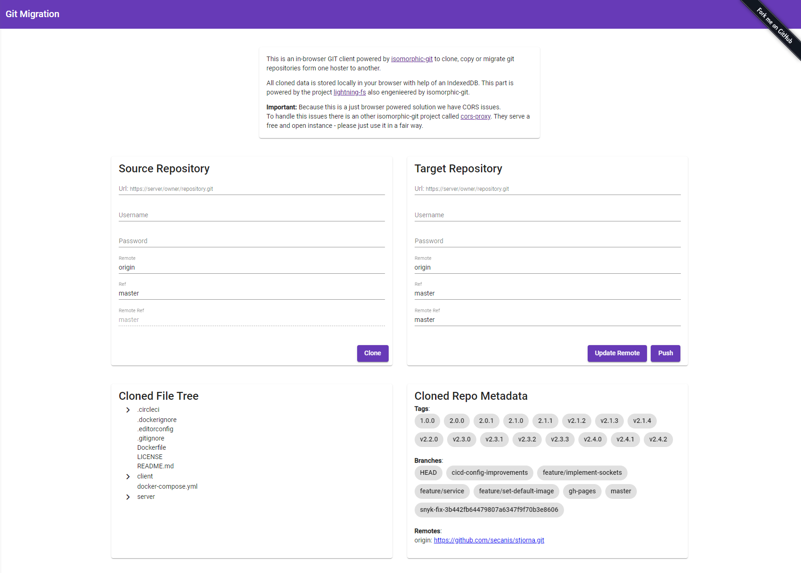

# Git Migrator

This is an in-browser GIT client powered by isomorphic-git to clone, copy or migrate git repositories form one hoster to another.

All cloned data is stored locally in your browser with help of an IndexedDB. This part is powered by the project lightning-fs also engenieered by isomorphic-git.

## Contribution

It would be very nice, when you give us a feedback or when you create issues if you detect problems or bugs. If you want to fix it yourself or you have an idea for something new, please create a PR, that would help us a lot.

Happy Coding <3 ...
